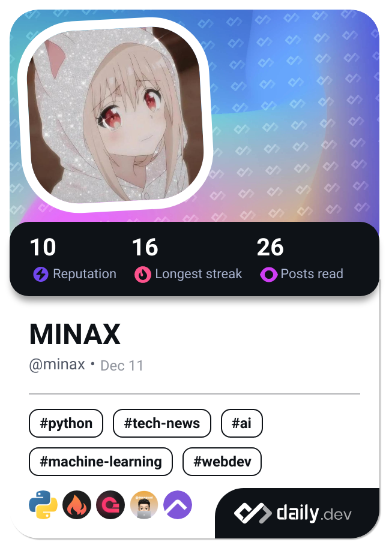

  <ul align="center" style="list-style: none">
    

      <h1>
        ❤️Hi, my name is MINAX
      </h1>
    

  </ul>

**<h3 align="left">Connect with me:</h3>** 

     

 **<h3 align="left">A student wanna pass APCS to get to university.</h3>**

**<h3 align="left">Rapid Fire</h3>**

- 💼 I'm currently working on: **💻 Trying new stuffs**
- 🌱 I'm currently learning: **📚Fuck Mathmatics**
- 💬 Ask me about: **💡 C++:<**
- ⚡ Fun fact: **🎢 owo**

 **<h3 align="left">Skills</h3>**

          

 **<h3 align="left">GitHub Stats</h3>**

  
  

  
  

 **<h3 align="left">Support Me</h3>**

